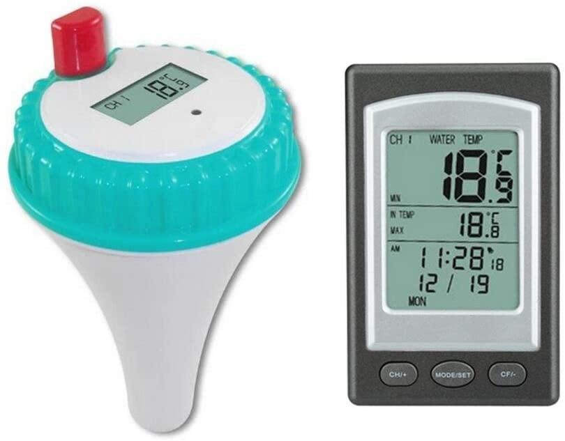
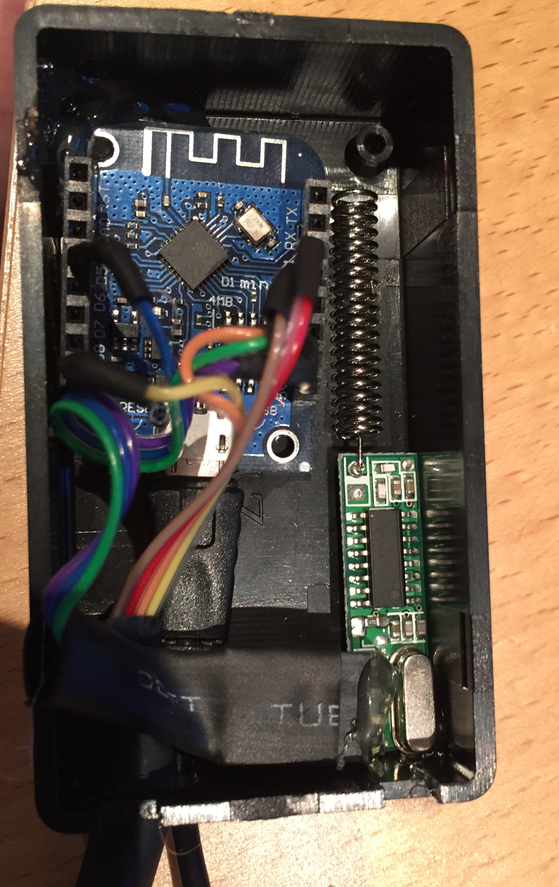

# ESPHome support for WD1228A  professional wireless pool thermometer

I bought this cheap chinese pool thermometer  and wanted to integrate it to home automation system.

I used Wemos D1 mini ESP8266 board with RX470-4 433,92 MHZ receiver to receive signal from thermometer.

In picture there is also additional wiring for BME280 sensor.

# Links

Receiver (https://www.aliexpress.com/item/32959397488.html?spm=a2g0s.9042311.0.0.27424c4dd2gmC9)

Thermometer (https://www.aliexpress.com/item/4000602727316.html?spm=a2g0o.productlist.0.0.1b4a2ed2aIYmTv&algo_pvid=ee151fef-fe1c-4074-84f5-c4ef15d7ff7e&algo_expid=ee151fef-fe1c-4074-84f5-c4ef15d7ff7e-0&btsid=0bb0622c16013711734605675eb0aa&ws_ab_test=searchweb0_0,searchweb201602_,searchweb201603_)
